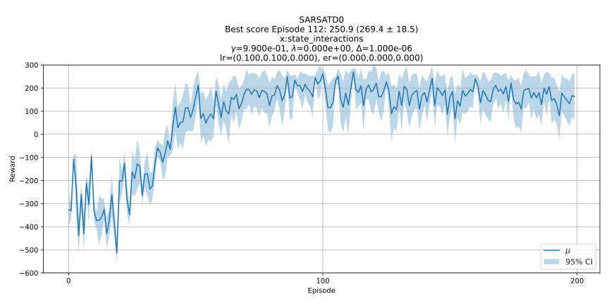
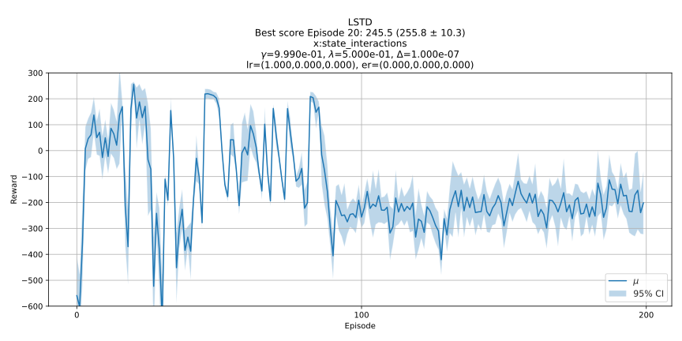

# Lunar Lander Solutions

This site provides an implementation of SARSA(TD0) and LSTD to solve Lunar Lander. Moreover, unlike other implementations you may see...this is basic RL (there's nothing deep about it) that uses a linear approximation described below rather than a neural network.  Why? Because regular RL is still effective! 

## Feature Vector and Basis Function

The observation space described in [Lunar Lander documentation](https://gymnasium.farama.org/environments/box2d/lunar_lander/) consists of the following:

>The state is an 8-dimensional vector: the coordinates of the lander in x & y, its linear velocities in x & y, its angle, its angular velocity, and two booleans that represent whether each leg is in contact with the ground or not.

This means the components of the the state are:

|$\mathbf{s}_t$|  | Description |
|-|-|-|
|$s_1$|$x$| Position in the horizontal plane |
|$s_2$|$y$| Position in the vertical plane |
|$s_3$|$v_x$| Horizontal velocity |
|$s_4$|$v_y$| Vertical velocity |
|$s_5$|$\theta$| Angle |
|$s_6$|$\omega$| Angular velocity |
|$s_7$|$f_l$| Boolean for the left foot  |
|$s_8$|$f_r$| Boolean for the right foot |

Then the observations or state, denoted $\mathbf{s}$, can be represented as 
$$\begin{aligned}
\mathbf{s} = (s_1, s_2, \cdots, s_8) = (x, y, v_x, v_y, \theta, \omega, f_l, f_r)
\end{aligned}$$

The algorithms presented all use the same feature representation $\phi$ that consists of the state vector $\mathbf{s}$ and all the unique interactions of variables in $\mathbf{s}$:
$$
\phi = \mathbf{s} \cup \left\{s_i​ s_j​ \mid \{i,j\} \in \binom{|\mathbf{s}|}{2} \right\}.
$$
This linear approximation is simplier that a neural network used in other solutions that are found for Lunar Lander. 

Next, let $\mathbf{A} = \{a_1, a_2, \cdots, a_n \}$ be the set of actions and $k = d|A|$. Then define the function $\Phi(\phi(\mathbf{s}),a): \mathbf{s} \times \mathbf{A} \rightarrow \mathbb{R}^{k}$ that returns the vector
$$
\Phi(\mathbf{x},a) := \left[ (a_1=a) \phi(\mathbf{s}), (a_2=a)\phi(\mathbf{s}), \cdots, (a_n = a)\phi(\mathbf{s}) \right].
$$
This return is the feature vector $\mathbf{x}$ mutlipied by the indicator function that is one for the action selected and zero otherwise.

## SARSA

Episodic Semi-gradient SARSA is implemented as described below by [Sutton and Barto](https://mitpress.mit.edu/9780262039246/reinforcement-learning/) with a the addition of normalization of the gradient vector.

>**INPUT**: A differentiable action-value function parameterization $\hat{q}: \mathbf{s} \times \mathbf{A} \rightarrow \mathbb{R}^k \rightarrow \mathbb{R}$.   
>**Algorithm parameters**: Step-size $\alpha > 0$, small $\varepsilon > 0$.  
>Initialize value-function weights $\mathbf{w} \in \mathbb{R}^k$ arbitrarily (i.e. $\mathbf{w} = \mathbf{0}$). 
>  
> Loop for each episode:  
>&nbsp;&nbsp;&nbsp;&nbsp;$\mathbf{s},a \gets$ initial state, action of episode (i.e $\varepsilon$-greedy) 
>&nbsp;&nbsp;&nbsp;&nbsp;Loop for each episode: 
>&nbsp;&nbsp;&nbsp;&nbsp;&nbsp;&nbsp;&nbsp;&nbsp;Take action $a$ and observe $r, \mathbf{s}'$ 
>&nbsp;&nbsp;&nbsp;&nbsp;&nbsp;&nbsp;&nbsp;&nbsp;If $\mathbf{s}'$ is terminal: 
>&nbsp;&nbsp;&nbsp;&nbsp;&nbsp;&nbsp;&nbsp;&nbsp;&nbsp;&nbsp;&nbsp;&nbsp;$\mathbf{w} \gets \mathbf{w} + \alpha[R - \hat{q}(\mathbf{s},a,\mathbf{w})]\nabla\hat{q}(\mathbf{s},a,\mathbf{w}) / ||\nabla\hat{q}(\mathbf{s},a,\mathbf{w})||$  
>&nbsp;&nbsp;&nbsp;&nbsp;&nbsp;&nbsp;&nbsp;&nbsp;Go to next episode.  
>&nbsp;&nbsp;&nbsp;&nbsp;Choose $a'$ as a function of $\hat{q}(\mathbf{s}',\cdot, \mathbf{w})$ (e.g. $\varepsilon$-greedy)  
>&nbsp;&nbsp;&nbsp;&nbsp;$\mathbf{w} \gets \mathbf{w} + \alpha[R + \gamma\hat{q}(\mathbf{s}',a',\mathbf{w})- \hat{q}(\mathbf{s},a,\mathbf{w})]\nabla\hat{q}(\mathbf{s},a,\mathbf{w})/||\nabla\hat{q}(\mathbf{s},a,\mathbf{w})||$  
>&nbsp;&nbsp;&nbsp;&nbsp;$\mathbf{s} \gets \mathbf{s}'$ 
>&nbsp;&nbsp;&nbsp;&nbsp;$a \gets a'$ 
The learning curve looks GREAT as shown below:

      

HOWEVER, looking at a recording of the policy, we see it's not that great. Why? The reward structure does not penalize landing outside of the landing zone enough. Reward shaping is required.

    

## LSTD
Well, lets try something different. So, we implement Least Squares Temporal Difference (LSTD). This method claims to have the advantage of rapidly arriving at a solution; however, initial gains are not sustained as we will see to result in a learning curve that looks as nice as the one seen the SARSA example.

A great description of LSTD is given in [Sutton and Barto](https://mitpress.mit.edu/9780262039246/reinforcement-learning/) as well as by [Lagoudakis and Parr](https://users.cs.duke.edu/~parr/jmlr03.pdf). The algorithm implemented is the $O(n^2)$ version of LSTDQ described by Lagoudakis and Parr that eliminates the requirement to take matrix inverses.

>**INPUT**: Feature representation $\mathbf{x}:\mathbf{s} \rightarrow \mathbb{R}^d$   
>**Algorithm parameters**: Some small parameter $\varepsilon > 0$.  
>  
> $\mathbf{B} \gets \frac{1}{\varepsilon} \mathbf{I}$ &nbsp;&nbsp;&nbsp;&nbsp; a $k \times k$ matrix  
> $\mathbf{b} \gets \mathbf{0}$ &nbsp;&nbsp;&nbsp;&nbsp; a $k$ dimensional vector  
> $\mathbf{w} \gets \mathbf{0} $ &nbsp;&nbsp;&nbsp;&nbsp; a $k$ dimensional vector  
> Loop for each episode:  
> &nbsp;&nbsp;&nbsp;&nbsp; Initialize $\mathbf{s}$; $\mathbf{x} \gets \phi(\mathbf{s}) $  
> &nbsp;&nbsp;&nbsp;&nbsp; For each step of the episode:  
> &nbsp;&nbsp;&nbsp;&nbsp;&nbsp;&nbsp;&nbsp;&nbsp; Choose action $a \gets \pi(\mathbf{x}, w)$, observe $r, \mathbf{s}'; \mathbf{x}' \gets \phi(\mathbf{s}')$ 
>&nbsp;&nbsp;&nbsp;&nbsp;&nbsp;&nbsp;&nbsp;&nbsp; $\mathbf{u} \gets \mathbf{B} \Phi(\mathbf{x},a)$  
>&nbsp;&nbsp;&nbsp;&nbsp;&nbsp;&nbsp;&nbsp;&nbsp; $\mathbf{v} \gets \left[ \Phi(\mathbf{x},a) - \gamma \Phi(\mathbf{x}',\pi(\mathbf{x}', \mathbf{w}))\right]^{\intercal}\mathbf{B}$  
>&nbsp;&nbsp;&nbsp;&nbsp;&nbsp;&nbsp;&nbsp;&nbsp; $\mathbf{B} \gets \mathbf{B} - \frac{\mathbf{u} \mathbf{v}}{1 + \mathbf{v}\Phi(\mathbf{x},a)}$  
>&nbsp;&nbsp;&nbsp;&nbsp;&nbsp;&nbsp;&nbsp;&nbsp; $\mathbf{b} \gets \mathbf{b} + r\mathbf{x}$  
> &nbsp;&nbsp;&nbsp;&nbsp;&nbsp;&nbsp;&nbsp;&nbsp; $\mathbf{s} \gets \mathbf{s}'; \mathbf{x} \gets \mathbf{x}'$  
> &nbsp;&nbsp;&nbsp;&nbsp;&nbsp; $\mathbf{w} \gets \mathbf{Bb} $

The learing curve in the plot below is not as nice as SARSA; however, the algorithm learns very quicly...but does tend to forget and ultimately loses it's initial gains after 100 episodes.

      

From a qualitative perspective, the policy achieved is much better than the one presented from SARSA. Specifically, the policy actually arrives within the landing zone at each iteration.

    

